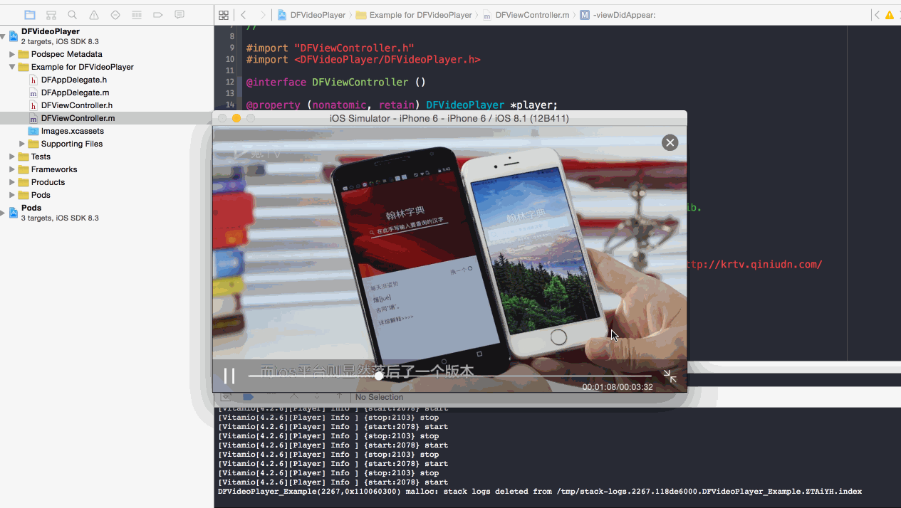

# DFVideoPlayer

[](https://sourcegraph.com/github.com/zhudongfang/DFVideoPlayer)
[](https://sourcegraph.com/github.com/zhudongfang/DFVideoPlayer)

[DFVideoPlayer](https://github.com/zhudongfang/DFVideoPlayer/) 改自 [KRVideoPlayer](https://github.com/36Kr-Mobile/KRVideoPlayer) 内部由 [Vitamio](https://github.com/yixia/Vitamio-iOS) 实现， 支持更多[视频格式](https://www.vitamio.org/en/License/)



## Usage

To run the example project, clone the repo, and run `pod install` from the Example directory first.

```
self.player = [[DFVideoPlayer alloc] initWithURL:url];
[self.player showInWindow];
// or
[self.player showInView:self.view]
// or
[self.player showInView:self.view inset:UIEdgeInsetMake(20, 0, 0, 0)];

```

## Requirements

```
iOS >= 6.0
```

## Installation

DFVideoPlayer is available through [CocoaPods](http://cocoapods.org). To install
it, simply add the following line to your Podfile:

```ruby
pod "DFVideoPlayer"
```

## Author

dongfang.zhu@inbox.com

感谢 [aidenluo](http://weibo.com/1840543654)
感谢 [cheyi](http://weibo.com/322160605)

## License

Please refer [License](http://www.vitamio.org/en/License/)
